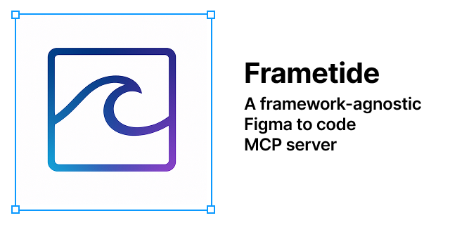

<p align="center">
  <br>
</p>

# Frametide - Figma components rolling in as code, just like the tide

[](https://www.typescriptlang.org/)
[](https://github.com/modelcontextprotocol/specification)
[](https://nodejs.org/)
[](LICENSE)
[](Dockerfile)

A **production-grade MCP (Model Context Protocol) server** that extracts component properties and design information from Figma files, providing structured data for automated component library generation and maintenance.

> **🚀 Perfect for AI agents** building design systems, generating component code, and maintaining design-code synchronization across any frontend framework.

## 📋 Table of Contents

- [🚀 Quick Start](#-quick-start)
- [🎨 Figma Setup](#-figma-setup)
- [🔧 Key Features](#-key-features)
- [🛠 Technology Stack](#-technology-stack)
- [🔧 Available Tools](#-available-tools)
- [🚀 Integration Examples](#-integration-examples)
- [🐳 Docker Quick Start](#-docker-quick-start)
- [🧪 Testing](#-testing)
- [📊 Monitoring](#-monitoring)
- [🔧 Troubleshooting](#-troubleshooting)
- [🤝 Contributing](#-contributing)
- [📚 Documentation](#-documentation)

## 🚀 Quick Start

```bash
# 1. Clone and install
git clone https://github.com/your-org/figma-mcp-server.git
cd figma-mcp-server
npm install

# 2. Interactive setup (creates .env with your Figma token)
npm run setup

# 3. Test your connection
npm run health

# 4. Start the server
npm start
```

### Prerequisites

- **Node.js 18+** 
- **Figma account** with access to files you want to extract from
- **Figma Personal Access Token** (see [Figma Setup](#-figma-setup) below)

> **📝 Note**: Modern Figma Variables require an Enterprise plan. The server works perfectly with legacy styles on all plan types.

## 📁 Project Structure

```
/
├── src/                    # Source code
│   ├── cli/               # CLI management tools
│   ├── extractors/        # Component & token extraction logic
│   ├── figma/            # Figma API integration
│   ├── services/         # Cache and core services
│   ├── utils/            # Security, logging, validation
│   └── __tests__/        # Test suite
├── docs/                  # Documentation
│   ├── requirements.md    # Functional requirements
│   ├── architecture.md    # System architecture
│   ├── api-specification.md # MCP API reference
│   └── figma-integration.md # Figma API details
├── USAGE.md              # Integration examples
├── DEPLOYMENT.md         # Production deployment guide
├── AGENT.md             # AI agent development guide
└── docker-compose.yml   # Container orchestration
```

## 🎯 Overview

This MCP server bridges Figma designs and frontend development by providing LLM coding agents with structured access to design system information, component specifications, and visual properties from Figma files.

## 🔧 Key Features

### Core Capabilities
- **🎨 Component Extraction** - Extract detailed component properties, variants, and specifications from Figma designs
- **🎯 Design Tokens** - Parse legacy styles and modern Figma variables (Enterprise) with semantic categorization (only works on Figma Enterprise plan)
- **🔧 Framework-Agnostic** - Generate specifications for React, Angular, Vue, Svelte, and any frontend framework
- **🔄 Change Detection** - Monitor design-code synchronization with intelligent change tracking
- **🤖 AI-Optimized** - Structured data perfect for LLM-powered code generation and automation

### Figma Integration
- **📱 Modern Variables** - Support for Figma's latest design token system (requires Enterprise plan)
- **🎨 Legacy Styles** - Full backward compatibility with traditional Figma styles
- **🔗 Intelligent API** - Optimized Figma API usage with rate limiting and error handling

## 🛠 Technology Stack

- **MCP Framework**: @modelcontextprotocol/sdk-typescript (broad LLM compatibility)
- **Target Models**: Any MCP-compatible LLM (Claude, GPT, Gemini, etc.)
- **Design Source**: Figma REST API with intelligent rate limiting
- **Target Frameworks**: Framework-agnostic (React, Angular, Vue, Svelte, etc.)
- **Runtime**: Node.js 18+ with TypeScript and ES modules
- **Caching**: LRU cache with configurable TTLs and memory management
- **Security**: Zod validation, rate limiting, audit logging
- **Deployment**: Docker, Kubernetes, PM2 ready

## 🎨 Figma Setup

### Creating a Personal Access Token

1. **Go to Figma Settings** → Account Settings → Personal Access Tokens
2. **Generate new token** with these scopes:
   - ✅ **File content** - Read file content and structure  
   - ✅ **File metadata** - Read file metadata and version info
   - ✅ **Library content** - Read published component libraries
3. **Copy the token** and add it to your `.env` file or environment variables

### Figma Plan Limitations

| Feature | Personal/Professional | Enterprise |
|---------|---------------------|------------|
| **Legacy Styles** | ✅ Full support | ✅ Full support |
| **Modern Variables** | ❌ Not available | ✅ Full support |
| **Component Extraction** | ✅ Full support | ✅ Full support |
| **Design Token Export** | ✅ Styles only | ✅ Styles + Variables |

> **💡 Important**: Figma's modern Variables API requires an **Enterprise plan**. The server gracefully falls back to legacy styles for other plan types.

### Testing Your Setup

```bash
# Test your Figma token and file access
npm run check-scopes

# Test with a specific file
npm run check-scopes YOUR_FILE_ID

# Validate file access
npm run cli validate-file --file YOUR_FILE_ID
```

## 📚 Documentation

| Document | Description |
|----------|-------------|
| [**USAGE.md**](./USAGE.md) | Integration examples and usage patterns |
| [**DEPLOYMENT.md**](./DEPLOYMENT.md) | Production deployment guide |
| [**AGENT.md**](./AGENT.md) | AI agent development guide |
| [**API Specification**](./docs/api-specification.md) | Complete MCP API reference |
| [**Architecture**](./docs/architecture.md) | System design and components |
| [**Requirements**](./docs/requirements.md) | Functional and technical requirements |

## 🔧 Available Tools

### 🔄 Workflow-Oriented Tools (New!)
| Tool | Description | Natural Usage |
|------|-------------|---------------|
| `set-working-file` | Set Figma file from URL | "Let's work on this file: [URL]" |
| `get-implementation-queue` | Get components by status | "Show me what needs to be implemented" |
| `get-component-for-implementation` | Full specs with framework hints | "Get implementation details for Button" |
| `update-component-status` | Track implementation progress | "Mark Button as implemented" |
| `get-working-file-info` | Session status and progress | "What's our current progress?" |

### 📋 Traditional Tools
| Tool | Description | Use Case |
|------|-------------|-----------|
| `get-component` | Extract detailed component properties | Generate component code |
| `list-components` | Get all components from a file | Browse component library |
| `get-design-tokens` | Extract design tokens (styles + variables*) | Build design system |
| `get-component-specification` | Rich component specs for any framework | Advanced code generation |
| `check-component-changes` | Monitor Figma changes | Automated updates |

_*Variables require Figma Enterprise plan_

## 🚀 Integration Examples

### With Claude Desktop
```json
{
  "mcpServers": {
    "figma": {
      "command": "node",
      "args": ["/path/to/figma-mcp-server/dist/index.js"],
      "env": {
        "FIGMA_ACCESS_TOKEN": "your_token_here"
      }
    }
  }
}
```

### With Cursor/VS Code
The server works with any MCP-compatible client. See [USAGE.md](./USAGE.md) for detailed integration examples.

### 🎯 Natural Workflow Example

```typescript
// 1. Agent: "Let's implement components from this Figma file: https://www.figma.com/design/abc123/Design-System"
await mcpClient.callTool('set-working-file', {
  url: 'https://www.figma.com/design/abc123/Design-System'
});

// 2. Agent: "Show me what components need to be implemented"
const queue = await mcpClient.callTool('get-implementation-queue');

// 3. Agent: "Let's implement the Button component first"
const buttonSpec = await mcpClient.callTool('get-component-for-implementation', {
  componentId: 'button-component-id',
  targetFramework: 'react'
});

// 4. Agent generates React component code using the specification

// 5. Agent: "Mark the Button as implemented"
await mcpClient.callTool('update-component-status', {
  componentId: 'button-component-id',
  componentName: 'Button',
  status: 'implemented',
  framework: 'react'
});
```

## 🐳 Docker Quick Start

```bash
# Clone repository
git clone <repository-url>
cd figma-mcp-server

# Set up environment
cp .env.example .env
# Edit .env with your FIGMA_ACCESS_TOKEN

# Run with Docker Compose
docker-compose up -d

# Check health
docker exec figma-mcp-server npm run health
```

## 🧪 Testing

```bash
# Run all tests
npm test

# Run with coverage
npm run test:coverage

# Run specific test
npm test -- --testNamePattern="cache"
```

## 🔒 Security Features

- **Input Validation**: All inputs sanitized with Zod schemas
- **Rate Limiting**: Configurable per-client rate limits (default: 100/hour)
- **Audit Logging**: Complete audit trail of all tool calls
- **Secrets Management**: Secure token handling with environment variables
- **Error Safety**: No sensitive data exposure in error messages

## 📊 Monitoring

```bash
# Health check
npm run health

# Test Figma connection
npm run cli test-connection

# Validate file access
npm run cli validate-file --file YOUR_FILE_ID
```

## 🔧 Troubleshooting

### Common Issues

#### No Design Tokens Returned
```bash
# Check if your file has published styles
npm run check-scopes YOUR_FILE_ID

# Common causes:
# 1. File has no published styles/tokens
# 2. Token lacks required permissions  
# 3. Variables require Enterprise plan
```

#### Variables Not Available
```
❌ Figma Variables API not available - Enterprise plan required
💡 The file_variables:read scope is only available with Figma Enterprise plans
```
**Solution**: Upgrade to Figma Enterprise or use legacy styles

#### Rate Limit Errors
```bash
# Check remaining API quota
npm run cli test-connection

# The server has built-in rate limiting:
# - 1000 requests/hour (configurable)
# - Automatic backoff and retry
```

#### Connection Issues
```bash
# Verify token and permissions
export FIGMA_ACCESS_TOKEN="your_token_here"
npm run check-scopes

# Check server logs
npm run dev  # Shows detailed logging
```

### Getting Help

1. **Check the logs** - The server provides detailed error messages
2. **Test with known files** - Use Figma Community files for testing
3. **Verify token scopes** - Ensure you have the required permissions
4. **Review documentation** - See [docs/](./docs/) for detailed guides

## 🤝 Contributing

We welcome contributions! Here's how to get started:

1. **Development Setup**: See [AGENT.md](./AGENT.md) for complete development guide
2. **Fork the repository** and create a feature branch
3. **Make your changes** with comprehensive tests
4. **Update documentation** for new features
5. **Submit a pull request** with clear description

### Development Guidelines
- ✅ **Type Safety**: All code must pass TypeScript strict checks
- ✅ **Testing**: Maintain >90% test coverage
- ✅ **Security**: Follow security best practices for API integrations
- ✅ **Documentation**: Update relevant docs for new features

## 🔗 Related Projects

- **[MCP Specification](https://github.com/modelcontextprotocol/specification)** - Model Context Protocol standard
- **[Figma API](https://www.figma.com/developers/api)** - Official Figma REST API documentation
- **[Design Tokens](https://design-tokens.github.io/community-group/)** - Design tokens community standard

## 🙏 Acknowledgments

- **Anthropic** for the Model Context Protocol specification
- **Figma** for their comprehensive REST API
- **TypeScript community** for excellent tooling and ecosystem

## 📄 License

MIT License - see [LICENSE](LICENSE) file for details.

---

<p align="center">
  <strong>Made with ❤️ for the AI agent and design systems community</strong><br>
  <a href="https://github.com/andreaswissel/frametide/issues">Report Bug</a> 
  <a href="https://github.com/andreaswissel/frametide/issues">Request Feature</a> 
</p>